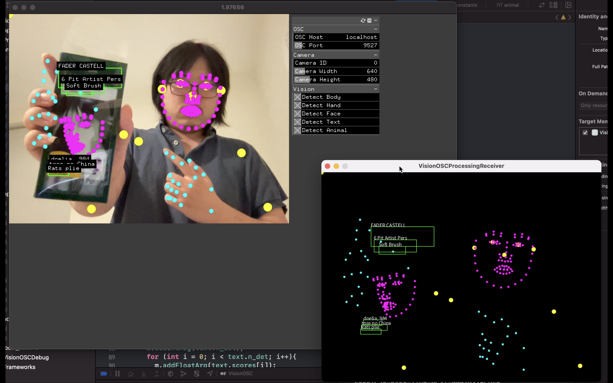

# Vision OSC

= PoseOSC + FaceOSC + HandOSC + OcrOSC + CatOSC + DogOSC

**[Download](https://github.com/LingDong-/VisionOSC/releases)** | **[Example](demos/VisionOSCProcessingReceiver/VisionOSCProcessingReceiver.pde)**

Send (almost) all Apple [Vision](https://developer.apple.com/documentation/vision) Framework's detection results via [OSC](https://opensoundcontrol.stanford.edu/). (You can pick which one(s) to detect & send). Written in [openFrameworks](https://openframeworks.cc/) using Objective-C++. macOS 11+ only. 

Inspired by [PoseOSC](https://github.com/LingDong-/PoseOSC), but faster, no more electron-bloat or horse neighing hacks. Compatible with the `ARR` format of PoseOSC.

## How to re-build in Xcode

Do not attempt to re-build (with projectGenerator) unless absolutely necessary, in which case follow the following steps:

- File > Project Settings, Build System -> New Build System
- Left sidebar, click project name, General > Frameworks, Libraries,... Add Vision, AVKit, Foundation, AVFoundation, CoreML
- Build Phases, Link Binary with Libraries, Change "mac catalyst" to "always"
- Change deployment target to 11.3
- For each file in src folder, on right sidebar, change file "Type" to Objective C++ (not extension, just in the dropdown menu)

## How to Use

Settings in `settings.xml` will be loaded upon start.

See [demos/VisionOSCProcessingReceiver](demos/VisionOSCProcessingReceiver) for a [Processing](https://processing.org/) demo receiving all the detection types.

### Receiving Poses from OSC

This is the same as [`ARR` format of PoseOSC](https://github.com/LingDong-/PoseOSC#method-4-arr), copied below:

ARR will be sent to `poses/arr` OSC Address as an array of values (OSC spec allows multiple values of different types for each address).

- The first value (int) is width of the frame.
- The second value (int) is height of the frame.
- The third value (int) is the number of poses. (When you read this value, you'll know how many more values to read, i.e. `nPoses*(1+17*3)`. So if this number is 0 it means no pose is detected, so you can stop reading).
- The next 52 values are data for the first pose, and the 52 values after that are data for the second pose (if there is), and so on...
- For each pose, the first value (float) is the score for that pose, the rest 51 values (floats) can be divided into 17 groups of 3, with each group being (x,y,score) of a keypoint. For the ordering of keypoints, see [PoseNet spec](https://github.com/tensorflow/tfjs-models/tree/master/posenet).

### Receiving Faces from OSC

Similar to pose format (see above); sent to `faces/arr` OSC Address:

- The first value (int) is width of the frame.
- The second value (int) is height of the frame.
- The third value (int) is the number of faces.
- The next 229 values are data for the first face, and the 229 values after that are data for the second face (if there is), and so on...
- For each face, the first value (float) is the score for that face, the rest 228 values (floats) can be divided into 76 groups of 3, with each group being (x,y,score) of a keypoint.

### Receiving Hands from OSC

Similar to pose format (see above); sent to `hands/arr` OSC Address:

- The first value (int) is width of the frame.
- The second value (int) is height of the frame.
- The third value (int) is the number of hands.
- The next 64 values are data for the first hand, and the 64 values after that are data for the second hand (if there is), and so on...
- For each hand, the first value (float) is the score for that hand, the rest 63 values (floats) can be divided into 21 groups of 3, with each group being (x,y,score) of a keypoint. For the ordering of the keypoints, see [handpose spec](https://google.github.io/mediapipe/solutions/hands.html)

### Receiving Texts (OCR) from OSC

Sent to `texts/arr` OSC Address:

- The first value (int) is width of the frame.
- The second value (int) is height of the frame.
- The third value (int) is the number of text regions.
- The next 6 values are data for the first text, and the 6 values after that are data for the second text (if there is), and so on...
- For each text, the first value (float) is the score for that text, the next four values (float) are the (left,top,width,height) of the bounding box. The last value is what the text says (string).

### Receiving Animal detections from OSC

Currently only cats and dogs are supported, per [Apple's documentation](https://developer.apple.com/documentation/vision/vnanimalidentifier).

Similar to texts format (see above); sent to `animals/arr` OSC Address:

- The first value (int) is width of the frame.
- The second value (int) is height of the frame.
- The third value (int) is the number of animals.
- The next 6 values are data for the first animal, and the 6 values after that are data for the second animal (if there is), and so on...
- For each animal, the first value (float) is the score for that animal, the next four values (float) are the (left,top,width,height) of the bounding box. The last value is what the animal is (string): "Cat"/"Dog".

The `JSON` and `XML` formats supported by PoseOSC are now excluded because I've since realized it's a silly idea to add this sort of parsing overhead. Let me know if you have a case against this decision.

I recommand [Protokol](https://hexler.net/protokol) for testing/inspecting OSC.

## Framerates

Tested on MacBook Pro (13-inch, M1, 2020) Memory 16 GB.

- Body: 60 FPS
- Hand: 60 FPS
- Face: 45 FPS
- Text: 10 FPS
- Animal: 60FPS
- Face, body, & hand: 25 FPS
- Everything all on: 5 FPS

